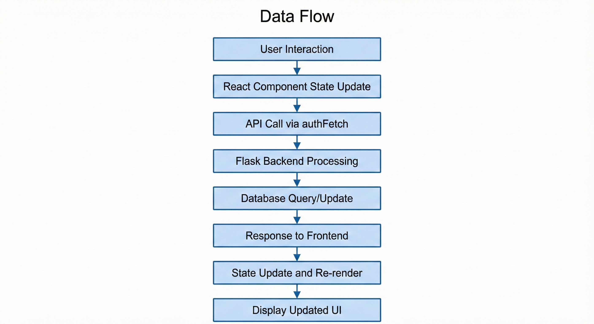

# MyMoney Pro - Personal Finance Management Application

A comprehensive, real-time personal finance management system built with React and Flask. Track expenses, manage budgets, set savings goals, and gain financial insights through advanced analytics and smart notifications.

## Table of Contents

- [Overview](#overview)
- [Features](#features)
- [System Architecture](#system-architecture)
- [Tech Stack](#tech-stack)
- [Project Structure](#project-structure)
- [Installation](#installation)
- [Usage](#usage)
- [API Documentation](#api-documentation)
- [Database Schema](#database-schema)
- [Configuration](#configuration)
- [Contributing](#contributing)
- [License](#license)

## Overview

MyMoney Pro is a full-stack personal finance management application designed to help users track their financial activities, create and monitor budgets, set and achieve savings goals, and manage recurring bills. The application provides real-time analytics, smart financial alerts, and comprehensive reporting capabilities.

### Key Highlights

- Real-time transaction tracking with intelligent categorization
- Multi-level budget management with spending alerts
- Savings goal tracking with priority-based income allocation
- Smart notification system with financial insights
- Comprehensive analytics with multiple chart types
- Dark mode support for comfortable usage
- Responsive design for desktop and mobile devices
- PDF and CSV export capabilities

## Features

### Dashboard
- Quick financial overview with net worth calculation
- Real-time summary cards showing income, expenses, and net balance
- Financial health score visualization with radar chart
- Smart alerts for budget overruns and goal milestones
- Upcoming bills preview with payment status
- Real-time spending trends analysis
- Category-wise spending distribution

### Transaction Management
- Complete transaction history with search and filtering
- Date range filtering (All Time, 7 days, 30 days, 90 days)
- Real-time analytics with multiple visualizations
- Transaction categorization with auto-complete suggestions
- Bulk operations and export capabilities
- CSV download functionality
- Detailed transaction reports

### Budget Tracking
- Create and manage multiple budgets by category
- Real-time spending calculation with progress tracking
- Budget utilization percentage with visual indicators
- Alert system for budget warnings and overruns
- Transaction preview for each budget
- Download budget reports in PDF format
- Smart category matching with case-insensitive search

### Savings Goals
- Set multiple savings goals with target amounts
- Priority-level assignment (High, Medium, Low)
- Income allocation based on goal priority
- Goal progress visualization with percentage complete
- Time-to-goal estimation
- Download goal progress reports
- Income transaction preview

### Bills Management
- Add and track recurring bills
- Payment status tracking (Pending/Paid)
- Due date reminders
- Bill aggregation and totals
- Quick status updates
- Integrated alerts for pending bills

### Analytics
- Daily spending breakdown with area chart
- Category spending comparison with bar chart
- Distribution analysis with pie chart
- Category-wise percentage breakdown
- Date range-based analytics
- Real-time data updates

### Notifications
- Smart alert generation based on financial activities
- Scrollable notification center with navigation
- Download notification reports
- Clear all notifications functionality
- Transaction details in alerts
- Budget warnings and goal milestone celebrations

### Additional Features
- User authentication with session management
- Dark mode toggle with localStorage persistence
- Professional PDF report generation
- Responsive design with mobile support
- Auto-complete category suggestions
- Real-time data synchronization

## System Architecture
<div align="center">
  
</div>


## Data Flow
<div align="center">
  
</div>

## Tech Stack

### Frontend
- React 18.2.0
- Recharts 2.5.0+ (Data Visualization)
- Lucide React (Icons)
- jsPDF 2.5.1 (PDF Generation)
- Tailwind CSS 3+ (Styling)
- React Hooks (State Management)

### Backend
- Python 3.9+
- Flask (Web Framework)
- Flask-SQLAlchemy (ORM)
- Flask-CORS (Cross-Origin Support)
- SQLite (Database)

### Build & Development
- Create React App
- npm/yarn (Package Management)
- Webpack (Module Bundling)

### External Libraries
- JWT (Authentication Tokens)
- HTML5 Blob API (File Generation)
- LocalStorage API (Client-side Persistence)

## Project Structure

```
mymoney-pro-nextlevel/
├── public/
│   ├── index.html
│   └── favicon.ico
├── src/
│   ├── App.jsx                 (Main Application Component)
│   ├── index.js               (React Entry Point)
│   ├── index.css              (Global Styles)
│   └── __tests__/
│       └── App.test.jsx
├── backend/
│   ├── app.py                 (Flask Application)
│   ├── __pycache__/
│   └── instance/              (SQLite Database)
├── build/                      (Production Build Output)
├── .gitignore
├── package.json
├── tailwind.config.js
├── postcss.config.js
└── README.md
```

## Installation

### Prerequisites
- Node.js 14+ and npm
- Python 3.9+
- Git

### Frontend Setup

1. Clone the repository:
```bash
git clone https://github.com/Cholarajarp/MyMoney_Daily_Financial_Management_Application.git
cd mymoney-pro-nextlevel
```

2. Install dependencies:
```bash
npm install
```

3. Create environment configuration (if needed):
```bash
# .env (optional)
REACT_APP_API_URL=http://localhost:5000
```

### Backend Setup

1. Create and activate virtual environment:
```bash
python -m venv .venv
# Windows
.venv\Scripts\activate
# macOS/Linux
source .venv/bin/activate
```

2. Install Python dependencies:
```bash
pip install -r requirements.txt
```

3. Initialize database:
```bash
python backend/app.py
```

## Usage

### Development

Start both frontend and backend:

```bash
# Terminal 1 - Frontend
npm start
# Runs on http://localhost:3000

# Terminal 2 - Backend
python backend/app.py
# Runs on http://localhost:5000
```

### Production Build

```bash
npm run build
# Creates optimized build in build/ folder

# Serve production build
npm install -g serve
serve -s build
```

### First-Time Setup

1. Open application at http://localhost:3000
2. Create new account via registration form
3. Login with credentials
4. Start by adding first transaction
5. Create budgets for spending categories
6. Set savings goals with priorities
7. Add recurring bills
8. Monitor analytics and alerts

## API Documentation

### Authentication

```
POST /api/login
Body: { username: string, password: string }
Response: { token: string, user: object }

POST /api/register
Body: { username: string, password: string }
Response: { token: string, user: object }

PUT /api/user/profile
Headers: Authorization: Bearer <token>
Body: { full_name, email, mobile, hobbies, bio }
Response: { success: boolean, user: object }
```

### Transactions

```
GET /api/transactions
Headers: Authorization: Bearer <token>
Response: [ Transaction ]

POST /api/transactions
Headers: Authorization: Bearer <token>
Body: { type, merchant, category, amount, date, description }
Response: { id, ...transaction }

DELETE /api/transactions/{id}
Headers: Authorization: Bearer <token>
Response: { success: boolean }

GET /api/analytics/spending-trend?days=365
Headers: Authorization: Bearer <token>
Response: [ { month, income, expense } ]

GET /api/analytics/category-breakdown?days=365
Headers: Authorization: Bearer <token>
Response: [ { name, value } ]
```

### Budgets

```
GET /api/budgets
POST /api/budgets
DELETE /api/budgets/{id}
```

### Goals

```
GET /api/goals
POST /api/goals
DELETE /api/goals/{id}
```

### Bills

```
GET /api/bills
POST /api/bills
PUT /api/bills/{id}
DELETE /api/bills/{id}
```

## Database Schema

### Users
```
id (INTEGER PRIMARY KEY)
username (VARCHAR UNIQUE)
password (VARCHAR)
full_name (VARCHAR)
email (VARCHAR)
mobile (VARCHAR)
hobbies (VARCHAR)
bio (TEXT)
created_at (DATETIME)
```

### Transactions
```
id (INTEGER PRIMARY KEY)
user_id (INTEGER FOREIGN KEY)
type (VARCHAR: 'income' or 'expense')
merchant (VARCHAR)
category (VARCHAR)
amount (DECIMAL)
date (DATE)
description (TEXT)
created_at (DATETIME)
```

### Budgets
```
id (INTEGER PRIMARY KEY)
user_id (INTEGER FOREIGN KEY)
category (VARCHAR)
limit (DECIMAL)
spent (DECIMAL)
created_at (DATETIME)
```

### Goals
```
id (INTEGER PRIMARY KEY)
user_id (INTEGER FOREIGN KEY)
name (VARCHAR)
target (DECIMAL)
current (DECIMAL)
priority (VARCHAR: 'high', 'medium', 'low')
created_at (DATETIME)
```

### Bills
```
id (INTEGER PRIMARY KEY)
user_id (INTEGER FOREIGN KEY)
name (VARCHAR)
amount (DECIMAL)
due_date (DATE)
status (VARCHAR: 'pending' or 'paid')
auto (BOOLEAN)
created_at (DATETIME)
```

## Configuration

### Dark Mode
Dark mode preference is stored in localStorage:
- Key: `darkMode`
- Value: `true` or `false`

### Date Formatting
All dates use ISO format: `YYYY-MM-DD`

Currency formatting uses Indian Rupee (INR) format by default.

### Chart Configurations
- Area Chart: Daily income vs expense trends
- Bar Chart: Category spending comparison
- Pie Chart: Category distribution analysis
- Radar Chart: Financial health scores

## Contributing

1. Fork the repository
2. Create feature branch (`git checkout -b feature/AmazingFeature`)
3. Commit changes (`git commit -m 'Add some AmazingFeature'`)
4. Push to branch (`git push origin feature/AmazingFeature`)
5. Open Pull Request

### Code Standards
- Follow React best practices
- Use functional components with hooks
- Maintain consistent naming conventions
- Add comments for complex logic
- Test features before submission

## Performance Optimizations

- useMemo for expensive calculations
- useCallback for event handlers
- Efficient state management
- Lazy loading of charts
- Optimized re-renders
- Code splitting support

## Security Features

- JWT-based authentication
- Password hashing
- CORS enabled for development
- Protected API endpoints
- Session-based authorization
- Input validation

## Known Limitations

- SQLite suitable for single-user/small deployments
- No real-time sync across devices
- Requires same network for local development
- Limited concurrent user support

## Future Enhancements

- Multi-currency support
- Recurring transaction automation
- Advanced budget forecasting
- Machine learning spending predictions
- Mobile app versions
- Cloud synchronization
- Multi-user collaboration
- Advanced reporting and exports

## Troubleshooting

### Common Issues

1. CORS Error
   - Ensure backend is running on port 5000
   - Check CORS configuration in Flask app

2. Database Lock Error
   - Close other connections to database
   - Delete .db file and restart

3. Port Already in Use
   - Change port in package.json scripts
   - Kill process using the port

4. Login Fails
   - Clear localStorage and cookies
   - Verify backend database is initialized

## License

This project is licensed under the MIT License - see LICENSE file for details.

## Contact

For questions, issues, or suggestions:
- GitHub: https://github.com/Cholarajarp/MyMoney_Pro_Daily_Financial_Management
- Email: ccholarajarp@gmail.com

## Support

If you encounter any issues or have suggestions:
1. Check existing GitHub issues
2. Create detailed bug report if needed
3. Include system information and steps to reproduce

## Version History

v2.1 - Current Version
- Enhanced analytics with bar charts
- Improved notification system
- Fixed category matching logic
- Added scrolling navigation in notifications

v2.0
- Complete system overhaul
- Real-time analytics
- Smart notifications
- Budget tracking enhancements

v1.0
- Initial release
- Basic transaction tracking
- Budget management
- Goals tracking
